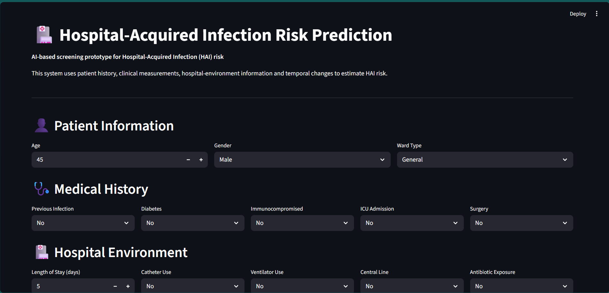
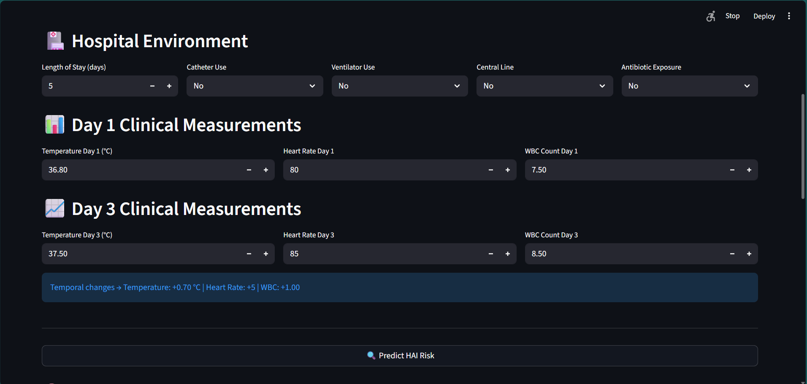
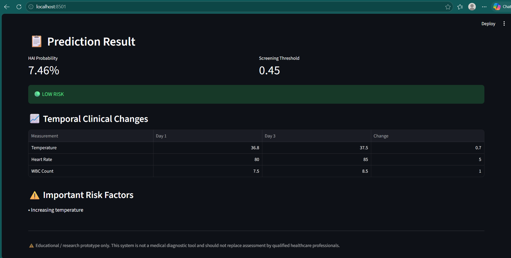

# 🏥 HAI Prediction System

### Machine Learning-Based Hospital-Acquired Infection Risk Prediction

An end-to-end machine learning application that predicts **Hospital-Acquired Infection (HAI) risk** using patient history, clinical measurements, hospital-environment factors, and temporal changes in patient condition.

The system includes **model comparison, threshold optimization, SHAP explainability, and an interactive Streamlit dashboard**.

> ⚠️ **Disclaimer:** This is an educational/research prototype using synthetic data. It is not a medical diagnostic system.

---

## 🚀 Features

- 🧑‍⚕️ Patient and medical history analysis
- 🏥 Hospital-environment risk factors
- 📊 Day 1 and Day 3 clinical measurements
- ⏱️ Temporal feature analysis
- 🤖 Logistic Regression, Random Forest and XGBoost
- ⚖️ Class-imbalance handling
- 🎯 Prediction threshold optimization
- 🧠 SHAP-based explainable AI
- 🌐 Interactive Streamlit dashboard
- 📈 HAI probability and risk classification

---

## 🧠 Machine Learning

### Models Evaluated

| Model | Accuracy | Recall | F1 Score | ROC-AUC |
|---|---:|---:|---:|---:|
| **Logistic Regression** | 72.60% | **68.27%** | **57.45%** | **0.7978** |
| Random Forest | **75.80%** | 38.38% | 46.22% | 0.7519 |
| XGBoost | 73.50% | 56.83% | 53.75% | 0.7619 |

**Selected model:** Logistic Regression

### Optimized Screening Threshold

The classification threshold was analyzed to study the trade-off between false positives and false negatives.

```text
Threshold:       0.45
HAI Recall:      77.49%
Precision:       46.56%
F1 Score:        58.17%
False Negatives: 61
```

---

### ⏱️ Temporal Analysis

The system compares important clinical measurements between **Day 1 and Day 3**.

### Monitored Changes

- 🌡️ **Temperature Change**
- ❤️ **Heart Rate Change**
- 🩸 **WBC Count Change**

This allows the model to consider **changes in the patient's condition over time**, rather than relying only on individual measurements.

---

## 🧠 Explainable AI

**SHAP (SHapley Additive exPlanations)** is used to understand the features influencing HAI predictions.

### 🔝 Important Features

1. **Length of Stay**
2. **ICU Admission**
3. **Surgery**
4. **Previous Infection**
5. **Age**
6. **Temperature Change**
7. **Catheter Use**
8. **Ventilator Use**
9. **Immunocompromised Status**
10. **Antibiotic Exposure**

SHAP provides both **global feature importance** and insights into how individual features contribute to predictions.

---

## 🖥️ Application Screenshots

### 👤 Patient Information & Medical History



### 🩺 Clinical Measurements



### 📊 Prediction Result



---

## 📁 Project Structure

```text
HAI-Prediction-System/
│
├── dataset/
│   ├── hai_dataset.csv
│   └── hai_temporal_dataset.csv
│
├── models/
│   ├── hai_model.pkl
│   ├── hai_temporal_model.pkl
│   └── hai_logistic_model.pkl
│
├── outputs/
│   ├── shap_feature_importance.csv
│   ├── shap_feature_importance.png
│   └── shap_summary.png
│
├── src/
│   ├── generate_dataset.py
│   ├── generate_temporal_dataset.py
│   ├── train_model.py
│   ├── train_temporal_model.py
│   ├── model_comparison.py
│   ├── threshold_analysis.py
│   └── explain_model.py
│
├── screenshots/
│   ├── patient-information.png
│   ├── clinical-measurements.png
│   └── prediction-result.png
│
├── app.py
├── .gitignore
├── README.md
└── requirements.txt
```


---

## 🛠️ Tech Stack

| Technology      | Purpose                   |
| --------------- | ------------------------- |
| 🐍 Python       | Core programming          |
| 🐼 Pandas       | Data processing           |
| 🔢 NumPy        | Numerical computation     |
| 🤖 Scikit-learn | Machine learning          |
| 🚀 XGBoost      | Gradient boosting         |
| 🔍 SHAP         | Explainable AI            |
| 📊 Matplotlib   | Visualization             |
| 📈 Plotly       | Interactive visualization |
| 🖥️ Streamlit   | Web application           |
| 💾 Joblib       | Model serialization       |

---

## ⚙️ Installation

### 1. Clone the Repository

```bash
git clone https://github.com/DevKatti7560/HAI-Prediction-System.git
cd HAI-Prediction-System
```

### 2. Install Dependencies

```bash
pip install -r requirements.txt
```

### 3. Run the Application

```bash
streamlit run app.py
```

### 4. Open the Application

Open the following URL in your browser:

```text
http://localhost:8501
```

---

## 📌 Key Results

| Metric                   |              Result |
| ------------------------ | ------------------: |
| **Selected Model**       | Logistic Regression |
| **ROC-AUC**              |          **0.7978** |
| **Default HAI Recall**   |          **68.27%** |
| **Optimized Threshold**  |            **0.45** |
| **Optimized HAI Recall** |          **77.49%** |
| **False Negatives**      |              **61** |

The threshold analysis demonstrates that adjusting the classification threshold from the default value can increase sensitivity to HAI cases in this experimental dataset.

> **Note:** This project is a machine-learning screening prototype and is not intended for direct clinical diagnosis or treatment decisions.

---

## 🔮 Future Scope

* 🏥 Validation using real-world hospital datasets
* 📡 Continuous patient monitoring
* 🧠 Longer temporal sequences using LSTM/GRU
* 📊 Model calibration
* 🌐 External hospital validation
* 🔐 Secure hospital-system integration
* 🐳 Docker-based deployment
* ☁️ Cloud deployment

---

## 👨‍💻 Author

### Devaraja Katti

**B.E. Artificial Intelligence & Machine Learning**

[](https://github.com/DevKatti7560)

---

## ⭐ Project

If you find this project useful, consider giving the repository a ⭐ on GitHub.
